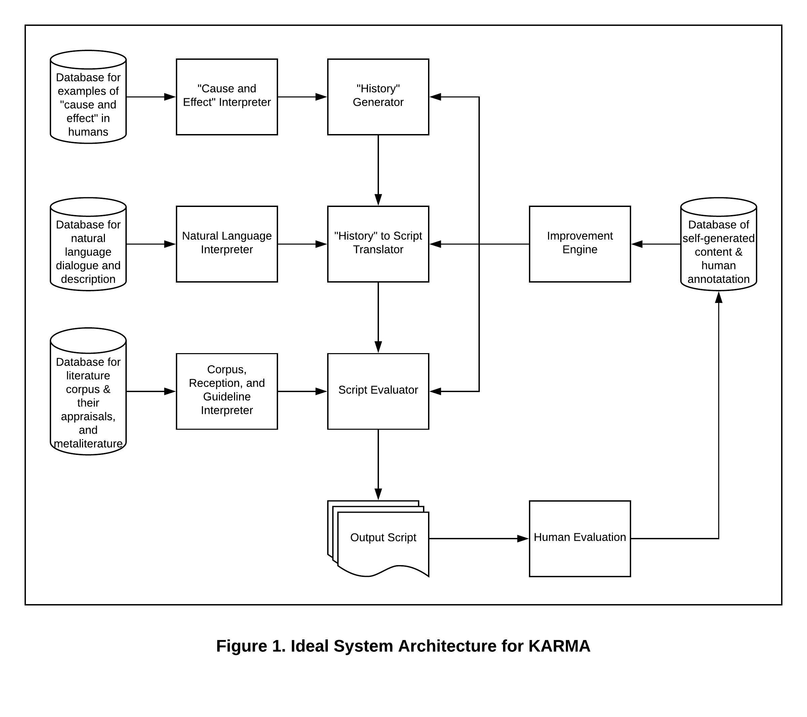

# KARMA -- a Consequence Focused Narrative Generating System

Author: James Wang
Date: 13th of December, 2018

In this README there is:
1. Overview and Introduction
2. Why Focus on Consequences
3. System Architecture
4. Computational Creativity Evaluation
5. KARMA’s Effect on Me
6. References

## Overview and Introduction
The KARMA project, standing for Karmic Aspect Revolving Media Arranger, is a system that in which I attempt to generate narratives where actions have causes and consequences. In the impressive existing works on computational narrative generation, there are already systems that seem to keep track of its own story’s events and show their continuing effect. Two of the best examples I found are from Botnik Studios and Pablo Gervás. Botnik’s *Harry Potter and the Portrait of what Looked Like a Large Pile of Ash* demonstrates a system that can narratively follow the effects of one action for a couple of lines via text predictions. The PropperWryter system modified from Gervás used for *Beyond the Fence* generates coherent plots with existing story schemas and a selection of actions available to the characters. While the depth and polish of both Botnik and PropperWryter and their products are much beyond the current KARMA system, from what I know of those systems and what I plan for mine, KARMA explores a method of narrative generation that should more clearly and intentionally model character interactions’ causes and effects.

## Why Focus on Consequences
Before proceeding to describe KARMA, I want to show the purpose of consequence-focused systems such as it. Consequence focused narrative systems interest me because stories where characters commit actions for reasons and the actions cause sprawling effects are more interesting to think about and re-read. In other words, engaging stories have characters who make sympathizable choices that impact their world. 

I borrow my point about the importance of consequential actions from Anton Chekhov, a great writer and one of the fathers of early theatre modernism. He maintains in a letter to his friend that it is important to “[r]emove everything that has no relevance to the story. If you say in the first chapter that there is a rifle hanging on the wall, in the second or third chapter it absolutely must go off. If it's not going to be fired, it shouldn't be hanging there.” This is now known as Chekhov’s Gun. Only add an element to a story if that element will have an effect. Or: every action must have a consequence.

Besides having consequences, actions must also have reasons. This I gather from Dan Harmon, a contemporary writer and creator for popular TV shows such as *Community*, *HarmonQuest*, and *Rick and Morty*. For example, often in his animated shows, he sets up a scene that one expects to cumulate in a dazzlingly heroic deed, then, he subverts this expectation by writing the character to do something grotesquely unheroic, and finally, he gives that character an easily sympathizable reason for their failure. While the expectation and subversion of heroism generate anticipation and intrigue, it is the character’s explanation for the subversion relates the character to the audience and makes for a compelling moment. By giving well-designed motives to well-placed actions, Harmon humanizes his characters and crafts compelling moments.

Anyways, I am not alone in thinking that an engaging story’s characters act from an understandable cause to an understandable effect. For being such an important part of writing, it is unfair that consequential storytelling is underdeveloped in the computational creativity research world. The ideological purpose behind consequence-focused systems like KARMA is to consider actions’ causes and effects more closely to generate better stories.

## System Architecture

### Ideal System Architecture for KARMA
In this section, I will describe the system architecture for the current ideal version of KARMA through its several processes: History generation, History to Script translation, Script evaluation, and the Improvement Engine.

#### History generation
History generation is the initial process in KARMA’s generation of a consequence-focused narrative that cumulates in the creation of a “History,” which is a list of sequenced actions detailed by their doers, recipients, causes, and effects. In other words, a plot map. An entry in a rudimentary History might look like “382. Action: murder. Doer: Bongo. Recipient: Ipsic. Cause: Bongo was poor, jealous, hateful, weak, opportunistic, and Ipsic was rich, contemptuous, arrogant, strong, distracted. Effect: Bongo is poor, jealous, hateful, weak, opportunistic, tired, insecure and Ipsic is rich, contemptuous, arrogant, strong, distracted, surprised, dead.” To have material from which to draw actions and their causes and effects, this section uses a database that curates examples of action causes and effects. This includes testimonies, psychological studies, news and journal articles, fiction, and any text that describes decisions’ motives or actions’ consequences, physical or psychological. From this database, the Cause and Effect interpreter creates generalizations for actions and associates certain character qualities with each of them as causes or effects. Finally, with computationally understandable sets of actions qualities, the History Generator writes a long history by creating characters with given qualities and following their trail of actions and effects.

#### History to Script translation
Given the History object from the previous process, the next step in KARMA is to make a Script out of the plot map. For this task, the system will consult a database of natural English language that should contain everything from film dialogue to salesman speeches. The purpose of this database is to provide a thorough basis of texts and their encapsulated meanings. From this, the Natural Language Interpreter learns how to express the meaning contained in a History entry through natural language. Partially, that also requires understanding how to edit and sequence information: what to leave unmentioned, what to elaborate on, and how to order the revealing of the actions. With this knowledge, the History to Script Translator transforms the History’s cold recounting of every action to something akin to a narrative piece.

#### Script evaluation
Now comes the time to evaluate the Script. For this, KARMA consults a database of relevant literary material, the critical and public reception of each piece, and also metaliterature such as Robert McKee’s *Story: Substance, Structure, Style and the Principles of Screenwriting* and John Truby’s *The Anatomy of Story: 22 Steps to Becoming a Master Storyteller*. This section’s interpreter then judges literary pieces by their reception and generate connections relating their reception to their style and their adherence to the metaliterature guidelines. Finally, the Script Evaluator will judge the system’s own creation and releases it as an output if it scores reasonably well.

#### Improvement Engine
As the Script enters the outside world and receives evaluations from human eyes, KARMA arranges the Script and its critical and public reception into a database similar to the previous section’s database for literature and their appraisals. The content of this database provides the resources to KARMA’s Improvement Engine. Its first function is to annotate KARMA’s previously generated pieces with areas of change and sends it back through the narrative generation system to make edits. Secondly, the Improvement Engine also adjusts each of the three previous processes to learn. This circles KARMA together as a learning and knowledgeable consequence-focused narrative generation system.

### Detailed System Architecture for the History Generator
In this section, I will describe the central aspect of this project, the History Generator, starting with its inspiration, then gradually moving through its system architecture, and at last mentioning two criticisms.

#### Inspiration
To George R. R. Martin I owe gratitude for the design of the History Generator portion of KARMA. Martin is another writer that demonstrates the importance of having a cause and effect for every action. In his book series, *A Song of Ice and Fire*, the literature behind the acclaimed *Game of Thrones* TV show, there is an impressive complexity in his characters. I think that, beyond drawing inspirations from “real history” to avoid writing “simple fantasy” and using “emotional truth […] to make your characters feel real,” his complex characters are products of his journey-oriented writing style. He describes himself as more of a “gardener” than an “architect” when it comes to writing. Instead of knowing “how many rooms there are going to be, how high the roof will be,” Martin prefers to “just dig a hole and plant the seed and see what comes up.” What entails are stories that faithfully follow its characters. In an interview that I can no longer locate, I seem to recall Martin saying that he just lets the characters write themselves. While this approach to writing has its deterrents (Martin also says that having to rewrite sections where the characters lead themselves into a prematurely dead end is why he writes so slowly), the result is a story where the characters feel like they belong.

#### System Architecture –– Qualities, Characters, and Actions
KARMA’s History Generator takes the same approach. After the Cause and Effect Interpreter completes its study of its database, it compiles the massive and detailed Qualities Set and Actions Set. The Qualities Set contains Quality objects that are keywords which describe a single aspect of a character. A Quality may happen to be unique to a specific character, but each Quality is representative of a state, whether it is personality, relationship, mood, or physical or ideological condition, which could apply to any character. Building on Qualities, the Actions Set contains Action objects, keywords which represent a single action with a table associated Qualities. Also build from Qualities is the Character object, which is fairly straightforward with a name, a list of Qualities, and a end condition such as death. A rudimentary example of an Action (Murder) and its associated Qualities follows:

To read the table: each cell of the pink row contains the Doer Character’s Qualities Set, each cell of the blue column contains the Recipient Character’s Qualities Set, and each orange cell contains the resultant effects on both Characters. (Note: the blank cells are only indicators for the purposes of this demonstration, as a data structure, only the colored cells exist.) At the moment, this table is incapable of producing a Murder Action with complex and relatable causes and effects. This is partially because each Character’s Qualities Set is too small, so an increase in available Qualities that would have made this table unsuitable for illustration will add complexity and nuance to the motivation. The lack of relatability, I think, is because this table does not expound on why the Characters have their current Qualities. More History is the solution since those Histories are the Actions and the backstory that created these Qualities in the first place.

#### System Architecture –– History Writing and Picking the Action
As soon as the Action Tables finish populating and the Character Generator polishes the cast, the History Writer module takes the Actions Set and Characters Set to create the narrative’s plot. The first and only step is to determine what is the Action that makes the most sense given the cast and their Qualities. To find out, this version of History Generator employs a brute force approach of trying out every Action for every pairing of Characters, giving each matchup a score, and then randomly picking from the top scoring Actions and Characters. To mimic the accidental entrance of new Characters in life and as a convenient solution to situations where no action can be taken, sometimes KARMA would add a new Character into the cast list.

#### Two Criticisms
At this point, two valid concerns come to mind. The first concern is that the model of Action that only incorporates the Doer and Recipient Characters does not allow for interesting group actions. For example, there might not seem to be a way to examine the interesting consequences of an accidental drunken theft of an expensive piano if the Steal action can only take in a Doer and a Recipient. Contrarily, I think that such a situation is easily within the capabilities of KARMA’s Action model. Instead of an Action that says, “A, B, and C Steals,” it would look something more like this: “A Invites B to Steal, A Invites C to Steal, B Contemplates Steal with C, C Contemplates Steal with B, B Contemplates Steal with B, C Contemplates Steal with C, B Agrees to Steal with A, C Agrees to Steal with A, A Steals with B, A Steals with C, B Steals with A…” and et cetera. In some cases, it may even be useful to increase the specificity.

The second concern is that the most-likely-to-happen method of plot devising creates undesirable predictability of the generated story. Indeed, when every Action comes with exact explanations, there might be a lot less of surprise and intrigue. Additionally, at times it also seems like, in life, interesting events come from people making the least-likely-to-have-happened choices. To address the first point of over-explaining: The product of this portion of the system is precisely required to contain a thorough explanation of every action. It does not make for an exciting tale, but that is why the History Generator is not the entirety of KARMA. It is the History Generator’s function to ensure that the material is coherent and annotated. If, and only if a History is well constructed, can the History to Script Translator in the next process construct a series of words that are not only pretty but also convey an understandable story. And to address the second point critiquing the realism behind the most-likely-choice: I can only speak from my own experience to say that the choice made without reasons is not as interesting as the choice made with many possible reasons. It is true that the Character who acts in clear accordance with their Qualities is not usually interesting. However, Characters that act completely out of the random, might, at most, provide comedic relief only. Intrigue happens when Characters act in such a way that the audience wants to know which of their Qualities really drove that Action. Under the assumption that this observation holds true, the answer to making interesting Character choices is not removing motivational Qualities but rather adding more of them such that the true motivational Quality is debatable.

## Computational Creativity Evaluation
In this section, I use Jordanous’s SPECS and PPPP Computational Creativity Evaluation systems to examine KARMA. Since KARMA is an unimplemented system, much of the evaluation is based on what the ideal version of KARMA will be.

### SPECS
#### Domain Competence
By the design of KARMA, before being capable of doing anything, the system needs to learn and become an expert in three domains. First, the domain of cause and effect, which is necessary for generating interesting Histories. The system needs to understand cause and effect as a concept and have a massive data set of Qualities and Actions, interpreted as causes and effects, to work from. Second, the domain of message conveying and natural language, required to translating the plot into prose. Third, the domain of good storytelling, so that the system can evaluate its scripts and ensure that they are not just a well-described series of logical actions. Most importantly, since none of these domains are hardcoded into the system and it summarizes rules and guidelines for itself by learning from relevant databases, it will be up-to-date with domain changes over time for as long as its databases are updated.

#### Thinking and Evaluation
Thinking and Evaluation apply to KARMA in two different ways. One, in the system’s handling of domain knowledge. KARMA writes its own rules regarding the domains it operates in. This implies that the system must have a sophisticated module of learning and rule writing. In other words, it must think about the raw information in its databases and generate meaningful axioms from them. Two, the system’s plot writing process. Every single plot point has its reasons in terms of why it happens and what it does. Any inquiry on the plot can be answered with a coherent justification. This would suggest that KARMA thinks about and evaluates its own products.

#### Originality
Confidently, I can say that KARMA is unique as a system. Ideologically, I have found no other narrative system whose focus is on consequential story writing. In practice, there is one system, Gervás’s Propper system, that uses similar objects in its plot design. Both KARMA and Propper use “actions” that are related to “characters.” However, Propper’s character actions are macro, broad stroke, setters for narrative format while KARMA’s Character Actions are micro, specific, responsive, and consequential to effecting the story. The difference is that Propper’s actions define a story while KARMA’s Actions are the story. So, when it comes to effect, KARMA is still unique.

KARMA’s products should also be unique. Of course, I am talking about ideal products from an ideal system. Should there be a sophisticated enough set of Qualities and Actions, the ideal system would write pieces that would read like good literature. That means many things, one of which is a certain amount uniqueness that distinguishes it from another piece. This should be especially guaranteed in the plot. If the detail and scale of Qualities and Actions that I hope for can be achieved by the Cause and Effect Interpreter, then, no two Histories from History Generator are likely to ever be the same. And, the results will not only be unique from one another but, hopefully, once the History has been translated into a Script and evaluated and edited for goodness, the Script would tell the History in such a manner that there are surprising twists and turns, subtleties that can change the interpretation of everything, and yet still logical coherence in everything.

#### Variety, Divergence, and Experimentation
Variety is the reason that KARMA generates unique products. As I previously mentioned, a complex and interesting plot depends entirely on the Qualities and Actions available to it. A massive library to choose from would mean that the Characters generated will always have different base Qualities. And, because of History Generator chooses each following action, even a single Quality difference between the Character sets of one plot compared to another can cause very quick divergence. As for experimentation, although it is not a major part of each generative cycle of KARMA because the system passes each product onto human evaluation, each generative cycle can be understood to be an experimentation with results that impact the next experiment.

### PPPP
Most of the evaluation here is repetitious of the previous section with SPECS, so I will keep this section short. KARMA as a Producer is meant to model life-like human interactions, and anyone who does well, I imagine to be fairly clever, creative, and very human themselves. Process-wise, KARMA’s writing philosophy is, as I previously mentioned, similar to Martin’s. So, while the system does not employ genetic functions or other complex generative loops, the story it linearly composes should still be at least as interesting as any other. When it comes to Product, again, KARMA is different from all other systems in that it intends to make good narratives based on coherency in plot logic, and of course to sound natural, tell wittily, and use structure to create intrigue. Whether or not it is a useful product depends on the user. It seems to be the case that the film industry has its own circle of screenwriters and much of the directing happens in close collaboration with the screenwriter. Should a screenwriter be the KARMA system, this close bond and teamwork between director and screenwriter cannot exist since there is no social interaction module for KARMA. For the film industry, KARMA might serve as a fine tool for inspiration, perhaps a source of adaptable stories, but probably not much more. What I can imagine is the History Generator component of KARMA being a useful tool that can model character interactions. An application of this could be in video game narratives where nonplayer characters act respectfully to their personalities, in reaction to the player, and in accordance to everything that has already happened in the game. Or also for changing character casts between playthroughs for replayability. Lastly, Press: I want this system to raise people’s standards for logic and motivation in narratives for films, television, and video games. But really, KARMA was not designed with anything in mind but to finally give the world a system that writes stories that make sense.

## KARMA’s Effect on Me
The purpose of my investigation in M7 is to understand a very specific aspect of screenplays and invent a solution for it. I have set out to study how to model consequential actions. For this, I’ve done research on current Computational Creativity development and professional writing advice. With this knowledge, I refined an unimplemented model of character-led narrative generation.

When the opportunity arose to begin implementing a rough prototype, I instead chose to focus on refining my research, overall system architecture, system analysis. I decided this because I imagined that building a working number of actions and quality-tables would not be as educational as thoroughly presenting the rest of the project. Admittedly, the dilemma between coding and writing was not a major issue until I realized that I had no time to do both. Afterwards, deciding to ignore the coding requirement of this project is one of the first times I challenged myself to be a student instead of a grade-monger.

That is what I have been doing. It is taking longer than I expected to write, but that might just be because it has been long since the last time I’ve written. I think that KARMA is the most thorough and original work I have for this course, even if it doesn’t make anything. This is the hardest that I have thought about a system and one of the only times that I designed and redesigned an architecture. This is the first time that I designed a large project and its architecture independently. This is the most that I have ever engaged with Jordanous’s creativity criterium. This is the longest that I have ever spent on any CS project. All this allows me to back up my design with opinions from conceptual space experts and to be sure that my system is nothing similar to any of its contemporaries.

Given the complexity of the conceptual project (modeling the network of character motives, actions, and reactions) and given the scale of the computational project (*Beyond the Fence* took seven teams of Computational Creativity researchers, just to generate a single musical, not even to write a system that will do the whole writing, editing, and self-evaluating shebang), I am reasonably satisfied with my work. While seeing KARMA’s History Generator implemented and producing results would be exciting and satisfying, I am also happy that I have chosen to develop and polish the idea behind my project.

To be properly reflective now, what exactly have I learned about myself during this project? I think I can finally see a future for myself in tech: that is constructing flow-charts. That is only about a half of a joke. I have found myself really enjoying myself organizing diagrams to represent architecture or pseudocode. I think I’m more curious about the conceptual development side of computer science compared to the technical. I don’t like working on the technical. My pseudocode shows it: whatever I do, if it is possible, I do it with for loops and if blocks. I also discovered that I have a real interest in how compelling stories are created. Additionally, I have a serious preference for blackboards and chalk over squeaky whiteboard oil.

## References
1. Botnik. Harry Potter and the Portrait of what Looked Like a Large Pile of Ash, https://botnik.org/content/harry-potter.html, 2017.
2. Colton, Simon. “The Beyond the Fence Musical and Computer Says Show Documentary,” http://repository.falmouth.ac.uk/id/eprint/2565, 2017.
3. Gervás, Pablo. “Schemas for Narrative Generation Mined from
Existing Descriptions of Plot,” 6th Workshop on Computational Models of Narrative, http://drops.dagstuhl.de/opus/volltexte/2015/5281/, 2015.
4. Johnson, Fred. “5 Things George R. R. Martin Can Teach You About Writing,” Standout Books, https://www.standoutbooks.com/george-r-r-martin-writing-advice/, 2018.
5. Just Write. “What Writers Should Learn From Dan Harmon,” YouTube, https://youtu.be/MXXFCIYo4Yg, 2017.
